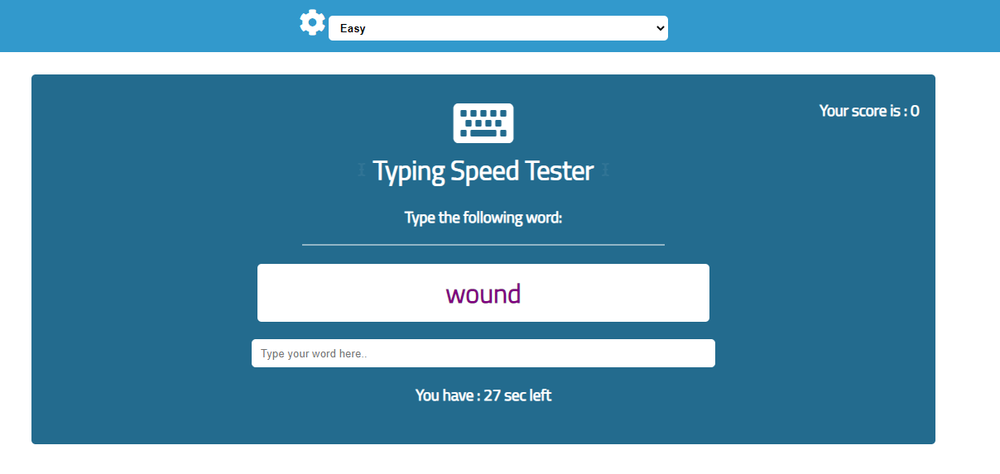

<h1># Type_Testing_Game </h1>

This is a javascript game to check typing speed. A user can click the start button
and then can start playing the game. This game will check user's typing speed. It will
give users ranom words to type and user has to type the words in order to score
a point. Every time user gets a word right, there will be some additional time to write
the next word. If user run out of time then the game will be over. User can set the difficulty of the game to "easy","medium" or "hard".

</h1>Additional description about the project and its features.</h1>

<h2>Built With</h2>

Html

CSS

Javascript

<h2>Live Demo</h2>
https://js-tab-2020.netlify.app/

<h2>Playing instructions</h2>
- set up the difficulty level
- click on the start button
- write the given words in the input field
- score will be visible on the top right corner.

<h2>Getting Started</h2>
To get a local copy up and running follow these simple example steps.

Clone the repository and get the files in your local branch. Use it according
to your convenience.

Prerequisites
Text editor,Github profile and Git.

<h2>Authors</h2>

👤 Author1

Github: https://github.com/ajkacca457

Twitter:https://twitter.com/ajkacca

Linkedin: https://www.linkedin.com/in/avijit-karmaker-8738a54a/

🤝 Contributing
Contributions, issues and feature requests are welcome!

Feel free to check the issues page.

Show your support
Give a ⭐️ if you like this project!

📝 <h2>License</h2>
This project is a personal project of Avijit.
